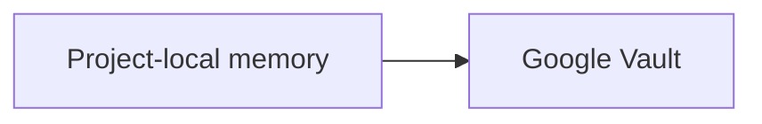

## Context

DashGPT has one portable local-first Vault v1. The browser-local Vault is the immediate working copy. Google Drive and GitHub are optional remote adapters for that same Vault rather than independent Card databases.

A software project needs two views of the same memory:

1. a visual, understandable view on the DashGPT site for a developer;
2. an ordinary local repository representation that an IDE or coding agent can read without browser storage access or a DashGPT plugin.

Those must not drift into two products or two data stores.

F19/PR #34 proved the value of a Project State visualization, but intentionally deferred real Vault-backed project-local persistence. F37 makes that direction part of the normal saved-Dash experience and gives the same Dash a filesystem representation.

## Architectural invariant

```text
canonical Cards in Vault v1
          ↓
      saved Dash D
       ↙       ↘
site Project   .dashgpt/
   view         files
       \       /
        same IDs
        same state
```

The Vault is authoritative. A saved Dash defines project membership. The site Project view and `.dashgpt/` are two projections of the same current saved Dash.

`.dashgpt/` is not a second Vault, not a remote sync provider and not a write-back database in F37.

## Why one saved Dash defines a project

The Vault can contain personal memory across unrelated topics. Exporting every Card into a repository would leak unrelated context and make project memory noisy.

Dash already represents a saved semantic selection over canonical Cards. F37 therefore uses one existing saved Dash as the project-memory boundary:

- materialize the latest non-deleted Dash revision;
- reuse existing event overrides and eligibility rules;
- use `view.members` as project Cards;
- exclude proposals, exclusions and unavailable references;
- never infer project membership from repository name, tags or filesystem path.

No parallel Project or ProjectCardMembership entity is introduced.

## Site integration: Project view inside saved Dash

The normal saved-Dash page remains the product entry point. F37 adds a **Project** view/mode to that page rather than creating another global Product Board or developer dashboard.

The Project view is derived from the exact same materialized Dash members as the normal Card gallery.

It should answer quickly:

1. What is this project/Dash about?
2. What work/state is represented by the current Cards?
3. Which Cards are active/current, completed/settled, or still have next work when that can be inferred from existing Card fields?
4. What are the important next steps/open questions?
5. How are the Cards related?

### Visual representation

The Project view has three compact layers:

- **Overview** — Dash title/description, Card count, source-state freshness and concise aggregate summary.
- **Project state** — visual Card tiles/rows derived from current members, showing title, summary, current state and next step when present. Clicking a tile opens the normal canonical Card.
- **Memory map** — a relationship graph over the same Card IDs. Explicit `relatedResults` relations are preferred. When no explicit relations exist, the view may still show Cards as a flat graph/list; it must not invent factual dependency claims from semantic proximity alone.

Semantic color already belonging to Cards remains a visual cue where available. F37 does not recompute color merely for Project view.

Project view never copies or mutates Cards. Switching between Gallery and Project view changes presentation only.

## Filesystem representation

The pure projection function consumes portable Vault v1 plus one materialized saved Dash view and returns a deterministic ordered list of UTF-8 files.

### Shape

```text
.dashgpt/
├── README.md
├── manifest.json
├── project.md
└── cards/
    ├── <stable-card-id>.md
    └── ...
```

No session, profile, provider-binding or token directories are generated.

### `.dashgpt/README.md`

A tiny entry point for humans and generic agents:

- this folder is generated project memory from DashGPT;
- canonical memory lives in the source Vault;
- start with `project.md`;
- inspect `cards/` for detailed canonical Card snapshots;
- regenerate from DashGPT to refresh;
- review content before committing to a shared/public repository.

### Stable filenames

Card filenames are derived only from canonical `result.id` using a filesystem-safe deterministic encoding. Titles never determine identity. Updating a title does not create a second local Card file.

The encoder must prevent traversal: `..`, slashes, backslashes and control characters cannot escape `.dashgpt/cards/`.

### `manifest.json`

The manifest is machine-readable and contains only safe source/projection metadata:

```json
{
  "schemaVersion": 1,
  "kind": "dashgpt-project-memory",
  "vaultId": "vault_...",
  "vaultUpdatedAt": "...",
  "dashId": "dash_...",
  "dashRevisionId": "dashrev_...",
  "dashTitle": "...",
  "dashUpdatedAt": "...",
  "cards": [
    {
      "id": "...",
      "path": ".dashgpt/cards/...md",
      "contentVersion": 1,
      "contentHash": "sha256:..."
    }
  ]
}
```

`contentVersion` / `contentHash` are copied when present; absence remains absence rather than inventing verification.

There is no wall-clock `generatedAt`: unchanged source state should produce byte-stable files.

### `project.md`: same mental model as site Project view

`project.md` is the local visual/human/AI representation of the same saved Dash. It mirrors the information architecture of the site Project view using plain Markdown:

- project/Dash title and description;
- source Vault/Dash identity and freshness;
- concise aggregate summary;
- Card count;
- one readable section/list for current Cards with title, summary, current-state/next-step cues;
- stable relative links to every Card Markdown file;
- an optional Mermaid graph using the same explicit safe Card relationships shown on the site.

Example direction:

```markdown
# DashGPT

> Project memory generated from DashGPT Vault `vault_...` / Dash `dash_...`.

## Current memory

- [Project-local memory](cards/project-local-memory.md) — portable project context for coding agents.
- [Google Vault](cards/google-vault.md) — account-backed copy of the same canonical Vault.

## Memory map


```

The surrounding Markdown must remain understandable when Mermaid is not rendered.

### Card Markdown

Each Card file includes stable canonical ID and useful working context in predictable headings:

1. title;
2. compact metadata (`Card ID`, category, tags, source when safe);
3. summary;
4. goal;
5. current state;
6. decisions;
7. facts/context;
8. constraints;
9. user preferences when already stored on the Card;
10. unresolved questions;
11. next/suggested next step;
12. related Card links/materials;
13. original conversation/source URL when HTTP(S).

Empty sections are omitted. Complex stored values are rendered conservatively as bounded readable JSON/fenced content.

## Relationship representation

Both site Project view and `project.md` should use the same relation extraction helper.

Preferred relation source:

- explicit `relatedResults` references between exported Card IDs.

The helper normalizes/deduplicates relations and ignores relations to Cards outside the current project Dash for the local/project graph.

F37 does not infer hard `depends-on`, `implements`, or `blocks` semantics solely from semantic similarity. A generic `related` edge is allowed only when represented explicitly by existing Card data.

## Local materialization / transport

The product model is not “download a ZIP.” The product model is the saved Dash plus its local `.dashgpt` representation.

For the first browser-only implementation, direct arbitrary repository-folder writes are not portable across Safari/Chromium. Therefore the saved-Dash Project view provides **Get .dashgpt** / **Download .dashgpt** as a materialization action. A deterministic ZIP containing the `.dashgpt/` tree is the universal browser fallback transport.

The UI explains: extract the `.dashgpt` folder at the repository root. A future CLI/IDE integration may replace this manual transport without changing the project-memory contract.

ZIP determinism rules:

- sort entries lexicographically;
- UTF-8 filenames/content;
- fixed ZIP metadata timestamp;
- stable CRC32;
- no random comments/extra fields.

## Google Drive composition

F25/F34 remain authoritative for account/Vault continuity:

```text
Device A local Vault V
 -> Google Drive DashGPT/dashgpt-vault.json (same V)
 -> Device B authorizes same account
 -> existing adoption/merge rules restore V
 -> saved Dash D appears with same IDs
 -> site Project view and .dashgpt regenerate from D
```

F37 does not request an OAuth token, call Drive APIs, add Drive files/folders, persist account email/display name/photo, alter `dashgpt.google-drive.binding.v1`, widen `drive.file`, or change provider exclusivity.

Google is how the **source Vault** follows the user. `.dashgpt` does not need its own Google synchronization.

## Privacy and repository policy

A repository may be shared more broadly than the user's Vault. Therefore:

- Project view is just a site projection of existing Cards and does not publish them;
- local materialization requires an explicit action;
- only current saved-Dash members are included;
- profile revisions, Google identity, provider bindings, credentials, sessions and unrelated Cards remain excluded;
- unsafe non-HTTP(S) source URLs are omitted;
- the local README warns that project memory should be reviewed before committing to a shared/public repository.

F37 does not automatically add `.gitignore` because project memory may intentionally be committed for team/agent portability.

## Failure states

- missing/deleted Dash -> Project view/export unavailable;
- zero accepted members -> Project view shows an empty project-memory state and materialization still produces a valid empty representation;
- unavailable Card reference -> omitted under existing Dash materialization rules;
- unsafe URL -> omitted from local Markdown;
- archive creation/download failure -> human failure state, no Vault mutation.

## Compatibility

No Vault schema, Card schema, immutable hash, Dash revision model, Google Drive adapter, GitHub adapter, search selection, Semantic Gallery membership, Structured Continuation payload, worker API or MCP tool changes.

F37 adds one presentation mode to saved Dash plus isolated projection/archive helpers. Both consume the same existing Vault/Dash state.

## Verification

Deterministic verification covers:

- site Project-view model and `.dashgpt` projection receive the same exact member Card IDs;
- excluded/proposal/unrelated Cards absent;
- relation extraction identical between site graph and Markdown Mermaid graph;
- stable safe filenames;
- deterministic README/manifest/project/Card bytes;
- source Vault/Dash/Card identity preservation;
- no provider/account/credential/profile/session fields;
- one-Card update leaves unrelated paths stable;
- ZIP integrity and exact entry set.

Browser regression covers:

- opened saved Dash can switch to Project view and still open canonical Cards;
- Project view shows current Card state/next cues and relation map without a separate product entity;
- local materialization action is available from Project view;
- downloaded package contains `.dashgpt/README.md`, `manifest.json`, `project.md`, expected Cards only;
- Vault is unchanged before/after materialization;
- Google-backed binding/identity is not serialized;
- no horizontal overflow at 360/390px.
